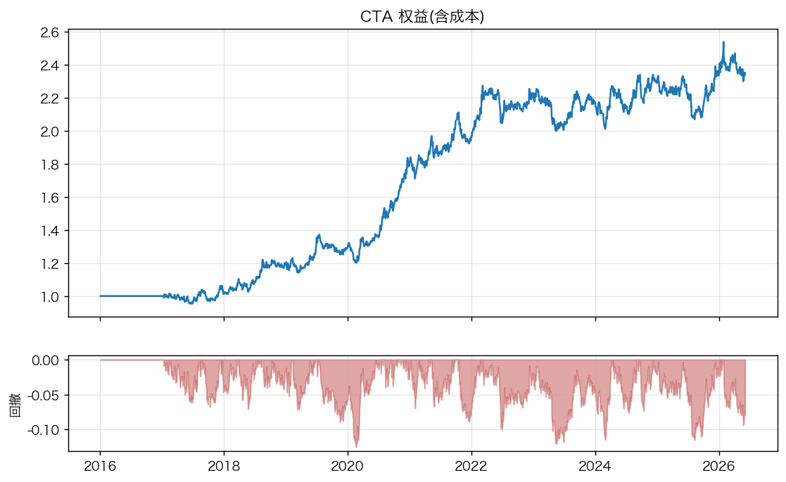
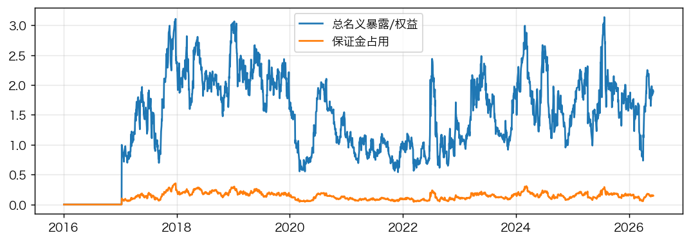

# CTA 回测报告 — 配置 7f30f4e94852 / 参数表 591b0de4 / 代码 00ec6a2

区间 2016-01-04 至 2026-06-05,22 个品种,初始资金 3,000,000 元。

## 绩效

| 指标 | 值 |
|---|---|
| 年化收益 | 9.62% |
| 年化波动 | 11.43% |
| 夏普(日频) | 0.86 |
| 夏普(月频) | 0.87 |
| 月频NW t | 2.91 |
| 最大回撤 | -12.53% |
| Calmar | 0.77 |
| 月胜率 | 61.06% |
| 偏度(月) | 0.22 |
| 期数(月) | 113.00 |
| 年化名义换手(倍) | 51.84 |
| 年化手续费占权益 | 0.31% |
| 年化滑点占权益 | 1.34% |
| 平均总名义暴露 | 1.59 |
| 平均保证金占用 | 13.10% |
| 未成交顺延次数 | 9.00 |




## 分年收益

|      |   收益 % |
|-----:|-------:|
| 2016 |   0    |
| 2017 |   1.86 |
| 2018 |  17.79 |
| 2019 |   7.74 |
| 2020 |  39.52 |
| 2021 |   9.01 |
| 2022 |  13.38 |
| 2023 |  -2.75 |
| 2024 |   5.86 |
| 2025 |   1.65 |
| 2026 |   0.68 |

## 分段

|           |   年化收益 |   年化波动 |   夏普(月频) |   最大回撤 |
|:----------|-------:|-------:|---------:|-------:|
| 2016-2019 |  0.066 |  0.094 |    0.877 | -0.089 |
| 2020-2022 |  0.199 |  0.118 |    1.522 | -0.1   |
| 2023-2026 |  0.016 |  0.116 |    0.19  | -0.115 |

## 分品种(盯市盈亏,不含手续费)

|    |   累计盈亏/初始资金 |   平均|暴露| |   成交笔数 |
|:---|------------:|---------:|-------:|
| AU |       0.283 |    0.076 |    307 |
| P  |       0.202 |    0.072 |    550 |
| V  |       0.197 |    0.071 |    633 |
| I  |       0.161 |    0.066 |    393 |
| AG |       0.138 |    0.05  |    539 |
| Y  |       0.129 |    0.086 |    503 |
| CU |       0.129 |    0.05  |    426 |
| RB |       0.121 |    0.075 |    512 |
| SN |       0.109 |    0.036 |    514 |
| JD |       0.101 |    0.118 |    489 |
| AL |       0.084 |    0.066 |    855 |
| SC |       0.074 |    0.029 |    253 |
| J  |       0.068 |    0.053 |    285 |
| TA |       0.045 |    0.058 |    672 |
| M  |       0.033 |    0.075 |    651 |
| RU |       0.006 |    0.069 |    412 |
| SR |      -0.054 |    0.076 |    777 |
| SA |      -0.054 |    0.037 |    244 |
| NI |      -0.061 |    0.036 |    560 |
| CF |      -0.064 |    0.078 |    580 |
| MA |      -0.081 |    0.055 |    720 |
| C  |      -0.165 |    0.1   |    823 |

## 成本导向试验(design_log 二b)

|             |   年化收益 |   年化波动 |   夏普(月频) |   月频NW t |    最大回撤 |   年化名义换手(倍) |   年化滑点占权益 |   年化手续费占权益 |   平均总名义暴露 | digest       |
|:------------|-------:|-------:|---------:|---------:|--------:|------------:|----------:|-----------:|----------:|:-------------|
| 主方案         | 0.0955 | 0.1146 |   0.8736 |   2.7817 | -0.1376 |     58.5707 |    0.0175 |     0.0035 |    1.6016 | e4addc075469 |
| a 缓冲带0.3    | 0.092  | 0.1148 |   0.8607 |   2.7944 | -0.1309 |     50.991  |    0.0151 |     0.003  |    1.6018 | 0be1808f413a |
| b 缩放按周      | 0.0957 | 0.1157 |   0.8875 |   2.8036 | -0.1392 |     59.7611 |    0.0178 |     0.0035 |    1.5997 | 2190e264b331 |
| c a+b       | 0.1009 | 0.1157 |   0.9424 |   3.0884 | -0.1393 |     51.942  |    0.0154 |     0.003  |    1.6081 | 2812c5c62f0b |
| d 单品种上限0.25 | 0.0915 | 0.1121 |   0.8528 |   2.6545 | -0.125  |     56.2935 |    0.0168 |     0.0033 |    1.5608 | 7a8a782a8d5e |

## 出处

数据指纹:`a9184ab336540a82`(2804 个文件);配置:
```json
{
 "version": "0.1.2",
 "universe": {
  "asset_classes": [
   "agri",
   "chem",
   "energy",
   "ferrous",
   "metal",
   "precious"
  ],
  "min_history_days": 250,
  "min_dominant_turnover_cny": 50000000.0
 },
 "signals": {
  "tsmom_lookbacks": [
   21,
   63,
   126,
   252
  ],
  "vol_window": 40,
  "carry_scale": 0.2,
  "weights": {
   "tsmom": 1.0,
   "carry": 1.0
  }
 },
 "portfolio": {
  "target_vol": 0.1,
  "max_leverage_per_symbol": 1.0,
  "max_gross_exposure": 3.0,
  "max_margin_usage": 0.4,
  "trade_buffer": 0.3,
  "vol_scale_update": "daily"
 },
 "execution": {
  "fill": "next_open",
  "slippage_ticks": 1.0,
  "roll_confirm_days": 3
 },
 "backtest": {
  "start": "2016-01-04",
  "end": "2026-06-05",
  "initial_capital_cny": 3000000.0,
  "cash_rate": "none"
 }
}
```