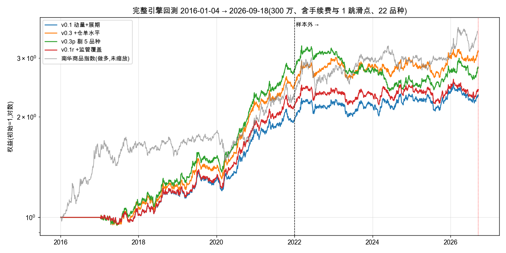

# 中国商品期货 CTA 原型:研究与实盘路径报告(v0.3 主线 · 五个版本纸面并行,2026-09-22)

> **【legacy,2026-09-23 起不再是正式基线】** 本版数字按 2026-09-22 前的口径计算(旧引擎:T+1 开盘定手数、未成交顺延、三腿换月;米筐段以收盘价代结算价)。正式基线已改为统一执行语义 + 交易所官方结算价,见 `report/report_v0.4.md`;本文件原样保留,便于逐项对照(两者的差异分解在 `docs/settle_baseline.md`)。

> 给评审者的一页摘要在第 0 节;每个数字都能在 `docs/design_log.md`(十六节、44 次计数试验)和 `results/` 里找到出处。日期均为北京时间。
> 仓库:https://github.com/goodzcyabc/cta-china-futures

## 0. 一页摘要

**做了什么。** 一个从数据到出单同一条代码路径的商品期货 CTA 系统:四家交易所直连的日频数据(行情、结算参数、会员持仓、仓单,2016 年起全量回填、每日增量、永不覆盖)、合约级回测引擎(换月双腿、涨跌停顺延、保证金预检、整手、按结算价盯市——2016 → 2026-06 段米筐无逐合约结算价,以收盘价代,见 §5.1 注)、事前协方差的波动率目标组合、纸面交易(次日真实开盘价成交,五本账并行,每日自动运行并 git 留痕)。代码质量门:ruff、mypy strict、108 个测试(含引擎级前视测试、纸面账故障注入测试)、CI。

**策略是什么。** v0.1:时序动量(4 个回看期)+ 展期收益,等权,10% 目标波动,22 个品种,300 万。v0.3:再加交易所仓单水平(按预注册规则从 24 个候选里唯一选入的新因子)。另有三个对照版本同在纸面上跑:v0.3p(剔除样本内亏钱的 5 个品种)、v0.1r(交易所上调保证金/手续费后动量减半)、v0.5(v0.3 信号只交易 12 个工业品;这个假设形成于看过全部数据之后,回测数字**只记录不作证据**,采用与否只看纸面)。

**回测怎么样(完整引擎、含成本、2016-01 → 2026-09)。**

| | 年化 | 夏普(月频) | 最大回撤 | 换手/年 | 样本内 2017–21 夏普 | **样本外 2022–26/6 夏普** |
|---|---|---|---|---|---|---|
| v0.1 | 9.2% | 0.84 | −14.3% | 53 | 1.27 | **0.31** |
| v0.3 | 12.6% | 1.10 | −14.0% | 65 | 1.71 | **0.29** |
| v0.5(事后假设,只记录) | 11.4% | 0.96 | −20.8% | 51 | 0.97 | 0.76 |
| 做多南华商品指数 | 12.7% | 0.83 | −23.4% | — | — | — |

v0.5 的样本外 0.76 是"按结果选品种"必然呈现的形状(去掉 2016–21 的赢家黑色/农产品,留下 2022 后的赢家有色/贵金属),同一操作让样本内从 1.71 掉到 0.97;两段都不能当证据,所以它只作为第五本纸面账前向检验。

**诚实结论。** (1) 2016–2022 年策略与行业同向且不弱;2023 年起明显落后行业(2025 年行业量化 CTA 均值 +13%,本策略 +2%),原因主要是展期收益因子 2022 年后失效(样本内夏普 1.5 → 样本外 −0.04)。(2) 三周里按预注册测了 24 个候选定义、44 次计数试验,样本内过线 3 个,**样本外没有一个改善**;免费公开数据里能挖的部分已经挖过。(3) 现有 22 个品种继承自朋友仓库,扩到未经挑选的 57 个品种时样本外为负,说明 22 品种的成绩含选择偏差,策略在中国商品上的公允水平可能低于表中数字。(4) 无前视:引擎级截断测试进 CI;"每个品种正回报"做不到,且证明了按历史盈亏剔品种在样本外是负价值。(5) 成本层没有免费的钱:5 种成交时点(开盘 / 30 分钟 VWAP / 60 分钟 VWAP / 日盘开盘 / 全天 VWAP)与 3 种调仓频率在 ±0.05 夏普内无差异,越拖越差;50–65 倍换手由信号本身决定。(6) 板块诊断:农产品 2022 年后亏的是慢动量(126/252 日)和展期收益,快动量(21/63 日)为正;贵金属恰好相反。只登记为候选,不据此改动(那是又一个事后菜单)。

**现在在跑什么。** 五本纸面账自 2026-09-16 起并行(v0.1 / v0.3 / 剔品种版 v0.3p / 监管覆盖版 v0.1r / 工业品版 v0.5),每个工作日北京 17:10 自动拉数、成交、盯市、出单,2026 年 12 月中按 `docs/deployment.md` 的标准比较净夏普、最大回撤、年化(需求方指定的三个指标)。这是所有版本唯一干净的样本外;信号层与成本层的研究到此停止,等纸面数据。

---

## 1. 任务与约束

- 起点(2026-09-03):守正用奇的题目"完成一个多因子策略,品种任选"。9-09 需求方明确:公司已有两个中证 1000 指增产品,建议做 CTA;定位是"进公司后 8 个月内上线的个人原型,代码质量是首要标准";评审看收益与夏普,更看有没有过拟合、前视、无法上线的问题。
- 约束:只用免费数据(米筐历史导出 + 交易所官网公开数据);资金 100–500 万(默认取中点 300 万);任何看过结果后的改动进设计日志并计试验数。
- 需求方后续要求逐条落实:参数按交易所核验(9-11)、与私募排排网产品对照(9-11)、挖掘因子(9-12)、接近实盘(9-14)、去 alphaXiv 找因子(9-16)、给品种分类每组三因子加权(9-21)、每品种正回报 + 无前视(9-22)、挖新数据(9-22)、"农产品差是不是动量太快"(9-22,已诊断)、暂不接 CTP 先把策略写好、评价指标为夏普/最大回撤/样本外年化(9-22)。

## 2. 系统

```
交易所官网(SHFE/INE/CZCE/DCE) ──每日──▶ data/exchanges/<所>/{quotes,params,positions,receipts}/<日>.parquet(点时,永不覆盖)
米筐导出(2016 → 2026-06-05) ─────────▶ StitchedSource(米筐历史 + 交易所增量;米筐没有的品种全程交易所)
                                          │
                              build_panels:主力判定(T−1 持仓量最大 + 3 日确认 + 只向更晚到期切换)、回溯复权、次主力、官方结算价
                                          │
                              compute_signals:tsmom / carry / receipts_level(可选)/ 监管覆盖(可选)→ 等权 → 协方差缩放到 10% → 上限 → 交易缓冲
                                          │
                 ┌────────────────────────┴─────────────────────────┐
        run_backtest(研究)                                   generate_orders(实盘/纸面)
        T 收盘出目标 → T+1 开盘 ± 1 跳成交 → 结算价盯市              同一函数,as-of = T,输出订单 + 输入快照 + 指纹
                                                                     │
                                                          paper/book:次日真实开盘价成交、盯市、每日 git 提交
```

- 合约参数:57 个品种的乘数、跳价、保证金、涨跌停、手续费全部按交易所官网一手来源核验(两名独立复核),带生效日与来源 URL(`configs/instruments.yaml`,`docs/instruments_verification*.md`)。生产品种池由配置显式列出 22 个,不随参数表变化。
- 结果目录以"配置指纹 + 参数表指纹"命名;每次出单的快照含 git sha、数据指纹、配置指纹。
- 质量门:`ruff format/check`、`mypy --strict`、`pytest`(108 项:合成数据单元测试 + 真实数据的三层截断不变测试 + 交易所解析样例 + 对账与故障注入测试)、GitHub Actions。

## 3. 数据

| 数据 | 来源 | 覆盖 | 用途 | 关键坑(已处理) |
|---|---|---|---|---|
| 合约日线(所有合约) | 米筐导出 → 交易所直连 | 2016-01-04 → 今 | 价格、成交、持仓、主力判定、复权 | 米筐 `dominant_daily` 是复权价不能算涨跌停;成交/持仓 2020-01-01 起单边计数;交易所白天文件是盘中快照(北京 16:30 前不抓 + 无结算价即拒收) |
| 结算/交易参数 | 交易所直连 | 2016 起(SHFE/INE/CZCE) | 官方保证金、手续费、涨跌停;机械推导"上调事件" | 上期所 DISCOUNTRATE 是平今倍数;郑商所 TradeParam 仅 2025-08 起 |
| 会员持仓排名 | 交易所直连 | SHFE/CZCE 2016 起;DCE 2020-07 起;INE 只公布达阈值合约 | 研究(已判死) | 郑/大商所全为经纪席位,无产业分类 |
| 仓单日报 | 交易所直连 | 2016 起 | receipts_level 因子 | 上期所多级合计行;苹果只有预报 |
| 现货基差 | 米筐导出 | 21 品种,2016 → 2026-06 | 研究(方向反,已剔) | 现货约 20% 日子不更新 |
| 外盘期货日线 | CNBC / LME 官方 / SGX | 23 序列,2016 起 | 研究(无增量,已剔) | 中国 T 日 15:00 只能用 ≤T−1 的外盘收盘 |
| 交易所调参公告 | 上期所/能源中心公告抽取 + 三所参数推导 | 6401 条 | 监管事件覆盖层 | 大商所公告需浏览器,未覆盖 |
| 南华商品指数 | 南华官网接口 | 2004 起 | 基线对照 | 与官方日报核对一致 |
| 行业基线 | 排排网/朝阳永续/媒体公开报告 | 2016–2026 | 对照 | 均为二手,逐条附来源 |

大商所的每日抓取依赖本机 Chrome 的远程调试(该所有反爬),上线前需替换。

## 4. 策略定义(v0.1 → v0.3,及三个对照版本)

- **时序动量**:回溯复权主力连续价,过去 21/63/126/252 日收益各自除以波动率并截断,四个回看期等权平均。
- **展期收益**:(主力 − 次主力)/次主力 按两合约到期间隔年化,tanh 压缩到 [−1, 1]。
- **仓单水平**(v0.3 新增):log(1+注册仓单) 在自身 252 日窗口内的分位,取负后做横截面 z-score。仓单高(可交割现货充裕)做空,仓单低(逼仓风险)做多。
- **合成**:等权平均,缺失因子不进分母,并按活跃因子数 √(n/n_max) 归一(避免因子少的品种被机械放大)。不拟合权重。
- **仓位**:每品种名义暴露 ∝ 合成信号 / 该品种波动率;40 日协方差把组合事前波动缩放到年化 10%;单品种 ≤1 倍权益、总名义 ≤3 倍、保证金 ≤40%;交易缓冲 0.30。
- **执行与成本**:T 收盘出目标 → T+1 开盘成交;每边 1 跳滑点;交易所手续费(按核验表);开盘触及涨跌停当日不成交(引擎顺延原目标,纸面次日按最新目标重出;统一方案待定);换月先平后开(纸面两腿预检同进退)。
- **监管覆盖**(v0.1r):交易所上调保证金/手续费(非节假日)后 21 个交易日,该品种动量信号 ×0.5;事件每日由结算参数机械推导。
- **剔品种**(v0.3p):v0.3 去掉样本内净贡献 ≤0 的 AG、AU、M、SA、SR,剩 17 个;规则先写再应用。
- **工业品池**(v0.5):v0.3 的信号、权重、风控、成本一字不改,`universe.symbols` 只留有色 CU AL NI SN、贵金属 AU AG、能源 SC、化工 MA TA V SA RU 共 12 个;不交易农产品与黑色。经济假设:动量 + 展期 + 仓单的溢价只存在于可储存、有产业链定价、金融属性强的工业品上。

## 5. 结果



### 5.1 完整引擎,2016-01-04 → 2026-09-18,300 万,22 品种,含手续费与 1 跳滑点
| | v0.1 | v0.3 | v0.3p(剔 5 品种) | v0.1r(监管覆盖) | v0.5(12 工业品) |
|---|---|---|---|---|---|
| 年化收益 | 9.2% | 12.6% | 11.3% | 9.6% | 11.4% |
| 年化波动 | 11.4% | 11.6% | 11.4% | 11.3% | 11.4% |
| 夏普(月频)/ NW t | 0.84 / 2.80 | 1.10 / 3.29 | 0.96 / 2.80 | 0.88 / 2.85 | 0.96 / 2.95 |
| 最大回撤 | −14.3% | −14.0% | **−26.7%** | −12.8% | −20.8% |
| 月胜率 | 60% | 67% | 59% | 59% | 55% |
| 名义换手 / 年 | 53× | 65× | 62× | 53× | 51× |
| 滑点 + 手续费 / 年 | 1.7% | 2.1% | 2.0% | 1.7% | 1.4% |
| 平均保证金占用 | 13% | 16% | 13% | 13% | 15% |

注(2026-09-22 执行一致性审计,`docs/design_log.md` 十七):(a) 引擎有一层手数带而纸面路径没有,把它关掉(= 纸面口径)v0.3 为年化 11.4% / 夏普 1.01 / 换手 70×,差额里只有 0.17pp 是成本,其余是仓位路径效应;(b) 引擎在 2016-01 → 2026-06 段按收盘价盯市(米筐逐合约数据无结算价),纸面按官方结算价,结算价收益的波动比收盘价低 15%,同样仓位纸面夏普口径高约 18%——比较纸面与回测时须扣掉这一层;用交易所结算价重做基线待做。这两处都不改变任何版本间的相对结论。

### 5.2 样本内 / 样本外(样本外 2022-01-04 → 2026-06-05 每个假设只看一次,不用于任何选择)
| | IS 2017–2021 夏普 | OOS 2022–2026/6 夏普 | OOS 年化 | OOS 回撤 |
|---|---|---|---|---|
| v0.1 | 1.27 | 0.31 | +3.9% | −12.0% |
| v0.3 | 1.71 | 0.29 | +3.9% | −14.2% |
| v0.3p | 1.81 | −0.03 | +0.5% | −26.7% |
| v0.1r | 1.46 | 0.18 | +2.4% | −12.8% |
| v0.5(事后假设) | 0.97 | 0.76 | +9.8% | −18.2% |

前四行样本内一列的递增是"按规则在样本内选出来"的直接结果,不是证据;样本外一列没有一个预注册版本超过 0.31。v0.5 一行的样本外 0.76 同样不是证据:它的品种池是在看过 2022–2026 逐品种盈亏之后定的,样本外数字因此只是这一观察的复述(见第 6 节十五)。

### 5.3 逐年(%)
| | 2017 | 2018 | 2019 | 2020 | 2021 | 2022 | 2023 | 2024 | 2025 | 2026(至 9/18) |
|---|---|---|---|---|---|---|---|---|---|---|
| v0.1 | 1.9 | 17.8 | 7.7 | 39.5 | 9.0 | 13.1 | −2.5 | 6.1 | 2.3 | −1.7 |
| v0.3 | 7.4 | 16.8 | 11.7 | 55.7 | 14.7 | 19.0 | −3.6 | 2.4 | 2.1 | 4.5 |
| v0.5 | 4.1 | 18.9 | −10.1 | 36.4 | 16.4 | 23.9 | −0.9 | 2.3 | 4.3 | 22.2 |
| 排排网量化 CTA 趋势指数 | 1.5 | 5.2 | 9.0 | 29.0 | 6.4 | 2.0 | −1.3 | 6.2 | 14.7 | — |
| 南华商品 | 7.9 | −5.8 | 15.6 | 7.4 | 20.9 | 19.7 | 6.2 | −1.3 | 5.4 | 16.1 |

### 5.4 其他
- 与洛书管理期货拾壹号(2022-01-27 起 +67%)同窗口,v0.1 +14.8%,南华 +40%(`docs/baselines.md`)。
- 资金规模:100 万时黄金、原油、铜、锡一手占权益 33–78%,持不住;200 万起可用;300 万为默认(`report/capital_scan.md`)。
- 分品种(v0.1,全样本):黄金、棕榈油、PVC、铁矿领涨;玉米、甲醇、纯碱、棉花、白糖为负。逐品种表 `results/exp_full/v03p_by_symbol.csv`。
- 分板块(v0.3,毛夏普,信号 T → T+1 收盘,`docs/design_log.md` 15.6):有色、贵金属、能源、化工 PVC/PTA 在样本内外都为正;农产品 7 个里 5 个样本外为负,黑色 3 个 2022 年后全负。农产品亏在慢动量(126/252 日,样本外 −0.48)与展期收益(样本内 1.06 → 样本外 −0.31),快动量(21/63 日)样本外 +0.37;贵金属相反(慢动量 1.57、展期收益 −1.31——贵金属的"展期收益"是利差,方向不同)。
- 执行层(v0.3,5 分钟线,`docs/exec_trials_is.md`):成交时点从时段首 bar 开盘换成 30/60 分钟 VWAP、日盘开盘或全天 VWAP,样本内 ±0.05 以内,样本外全部差 0.10–0.17;每 2 日 / 5 日调仓换手只降 10% / 23% 而夏普下降。1 跳滑点 = 0.7 bp(AU、SN)到 8.9 bp(I);真实成交围绕开盘价散布 ±15–50 bp 但无系统方向,1 跳假设保留。

## 6. 研究方法与全部试验

**规则**:每个假设先写定义、预期方向、评估口径、采用规则,再看数;方向写反不翻号;样本内(2016–2021)决定,样本外(2022–2026/6)只记录一次;所有看过结果后的改动记为"事后改动"并留痕(9 条);试验计数(44)用于 Deflated Sharpe。样本外段在多轮研究里被反复看过,已不再干净——这是纸面账存在的原因。

| 轮次 | 假设 | 样本内 | 样本外 | 结论 |
|---|---|---|---|---|
| 二b | 成本导向 5 变体(缓冲带等) | 按规则选缓冲 0.30 | — | 采用 |
| 四–六 | 11 个价格类因子(EWMAC、突破、横截面动量/展期、基差动量、偏度、持仓量增长、季节性、低波动、量价复合、12 日反转) | 无一同时满足"强、独立、稳定";3 个方向反 | v0.1 1.49 → 0.34,几乎全由 carry 失效造成 | 核心不变 |
| 七 | alphaXiv/arXiv 7 篇精读 | 无拿来就能用的因子;两条负面证据(季节性、LLM 因子) | — | 登记候选 |
| 九–十 | 会员持仓(套保压力、知情席位)、仓单水平、仓单变化 | 知情席位两道门槛判死;仓单水平选入(1.39,t 3.7,相关 0.12) | 仓单水平 0.47;v0.3 全引擎 0.29 vs v0.1 0.31 | v0.3 进纸面 |
| 十一 | 扩品种 23→57;跳价过滤 | 0.81 / 1.04 vs 1.27 | −0.41 / 0.06 | 都不采用;揭示 22 品种含选择偏差 |
| 十二 | 板块因子菜单(等权/逆波动率) | 1.10 / 1.23 vs 1.71 | 0.82 / 0.87 vs 0.29(全部来自贵金属仓位放大) | 不采用 |
| 十三 | 现货基差、基差动量、外盘趋势溢出、监管事件覆盖 | −0.28、−1.66、0.38、+0.11(采用) | 监管覆盖 −0.26 | 覆盖层进纸面(v0.1r) |
| 十四 | 剔除样本内亏钱品种(P1);滚动流程测试 | 1.81 vs 1.71 | −0.03 vs 0.29;滚动 0.86 vs 1.05 | 按历史盈亏剔品种为负价值;仍进纸面作前向检验 |
| 十五 | v0.5 工业品池(12 品种;假设形成于看过全部数据之后) | 0.97(只记录) | 0.76(只记录) | 两段都不作证据;第五本纸面账,12 月与 v0.3 比 |
| 15.6 | 诊断"农产品是否动量太快"(分板块 × 因子 × 快慢) | 农产品 carry 1.06、慢动量 0.47 | 慢动量 −0.48、carry −0.31、**快动量 +0.37** | 假设方向反:是太慢 + 展期失效;登记候选 C16,不改动 |
| 十六 | 成交方式 5 变体(X1);调仓频率 2/5 日(X2);滑点校准 | F1/F2 +0.04(门槛 0.05);降频 −0.07 | 替代成交方式全差 0.10–0.17;降频 −0.01 / −0.25 | 保留开盘成交与日频;1 跳滑点保留;成本层无杠杆 |

诊断(不选因子):趋势策略十年的收益主要来自少数品种的持续单边(黄金、白银、PVC),不是短期延续;2022 年后变强的是 3 个月到 1 年的均值回复(`docs/diagnostics_acf_tick.md`)。

## 7. 前视与选择偏差审计(`docs/lookahead_audit.md`)

- 每个输入的可得时间逐项列表(行情结算后、主力用 T−1 持仓、仓单收盘后、现货用 T−1、参数用现行常数)。
- 三层自动化测试:信号级、因子级、**引擎级**截断不变(用截至 2025-03-14 的数据跑完整流程,与全量数据在此前每一天的权益、持仓、成交逐项相等),全部进 CI。
- 历史上抓到并修掉的四次时序错误全部留痕(复权价误用于涨跌停、盘中快照出单、换月日板基准、回测截止后持仓延续)。
- 不属于前视但属于选择偏差的四处如实列出:继承的 22 品种;被多轮使用的 2022–2026"样本外";剔品种版的品种池;工业品版的品种池(事后假设)。

## 8. 实盘路径与纸面交易

- 每个工作日北京 17:10(launchd):拉四所当日数据(结算闸门 16:30;盘中快照拒收)→ 用昨日订单按今日开盘价成交、按结算价盯市 → 以今日为截止日出明日订单 → 全部落盘并 git 提交。五本账:`paper/`(v0.1)、`paper_v03/`、`paper_v03p/`、`paper_v01r/`、`paper_v05/`,自 2026-09-16 起,同一数据同一规则。截至 2026-09-22 收盘(5 个交易日):v0.1 296.2 万、v0.3 299.0 万、v0.3p 300.6 万、v0.1r 与 v0.1 逐日相同(2026 年 4 月后无合格上调事件)、v0.5 298.9 万;成交率 100%,盯市对账无差异。5 天说明不了任何事——3 个月也不能用来选版本(夏普差的标准误 ±1.3),纸面期定位为工程验收(`docs/deployment.md`)。
- 2026-09-22 起纸面账加了防线(设计日志十七):开盘价为空不成交(此前会按 NaN 成交并静默毁账)、换月两腿同进退、持仓缺结算价整日失败、日步全有或全无、失败写 FAILED.json + 非零退出 + 通知。用新代码从前一日状态重放 09-22,五本账与已提交结果逐字段一致。
- 通过 / 中止标准(3 个月,2026-12 中):净夏普与回测同期差在 ±0.5 内、成交率 ≥95%、盯市对账无差异;v0.5 采用规则先写:纸面净夏普 ≥ v0.3 且回撤不劣,否则作废。
- 已知运行风险:大商所抓取依赖本机浏览器;现货类数据无实时源(相关因子未选入,无影响)。
- 上线前仍需:经纪商实际费率与逐日参数覆盖、CTP 仿真盘(SimNow)对接(需求方:暂不做)、监控告警、大商所无浏览器抓取。

## 9. 结论

1. **可上线的骨架**:数据、引擎、风控、出单、留痕、测试、CI 齐备,同一条代码路径从研究到纸面。
2. **信号弱且集中**:两个教科书信号加一个仓单因子,全样本夏普 0.84–1.10,2022 年后 0.2–0.3;收益集中在贵金属与有色,农产品化工长期为负。
3. **公开数据已挖尽,成本层也走完了**:24 个候选定义、44 次计数试验,样本外无一改善;执行方式与调仓频率在 ±0.05 夏普内无差异。真正没碰过的只剩付费基本面数据(社会库存、开工率)。
4. **对"每品种正回报"的回答**:样本内可构造,样本外做不到,且做法本身有害;逐品种盈亏全部公开。板块层面有结构(工业品正、农产品/黑色负),但据此选池是事后假设,只能前向检验(v0.5)。
5. **对"农产品是不是动量太快"的回答**:不是。农产品亏在慢动量和展期收益,快动量样本外为正;登记为候选,不改动。
6. **下一批证据来自五本纸面账**,2026 年 12 月中按夏普、最大回撤、年化比较;在此之前不再改信号。

## 10. 文件索引

| 想看什么 | 去哪里 |
|---|---|
| 每一次决定与试验 | `docs/design_log.md` |
| 因子研究细表 | `docs/factor_research_*.md`、`factor_newdata_*.md`、`factor_spotbasis_is.md`、`factor_global_is.md`、`factor_reg_*.md`、`factor_combo_*.md` |
| 执行层试验 | `docs/exec_trials_is.md`、`exec_trials_oos_2026-06-03.md`、`scripts/exec_fills.py`、`exec_trials.py` |
| 参数核验 | `docs/instruments_verification*.md`、`configs/instruments.yaml` |
| 数据接入 | `docs/data_exchanges_*.md`、`data_exchange_params.md`、`data_exchange_events.md`、`data_global_futures.md`、`data_notes.md` |
| 前视审计 | `docs/lookahead_audit.md`、`tests/test_no_lookahead*.py` |
| 基线对照 | `docs/baselines.md`、`docs/industry_baselines.md` |
| 运行手册 | `docs/deployment.md`、`scripts/paper_daily.sh`、`deploy/com.cta.paper.plist` |
| 纸面账 | `paper*/equity.csv`、`paper*/orders/<日>/`、`paper*/log/<日>.json` |
| 回测原始输出 | `results/exp_full/`(全样本)、`exp_is/`、`exp_oos/`(不进 git) |
