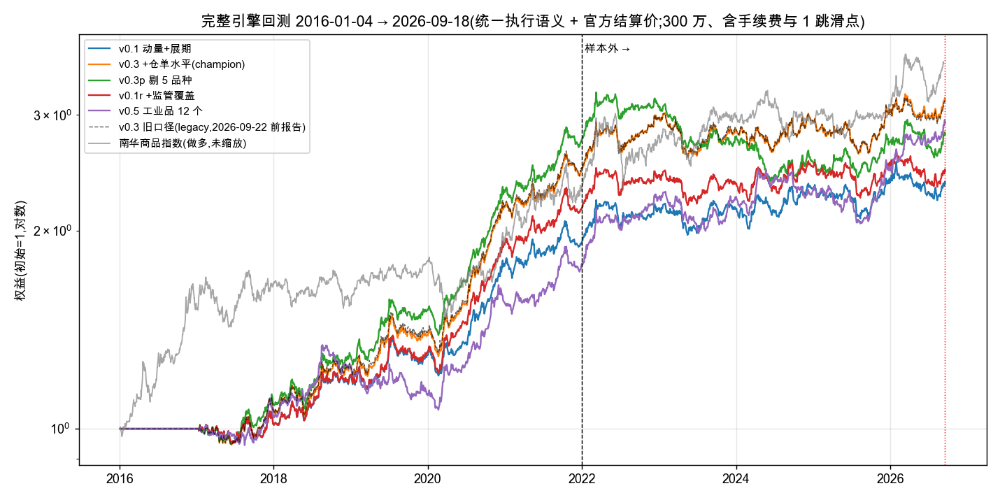

# 中国商品期货 CTA 原型:研究与实盘路径报告(v0.4,2026-09-23)

> 相比 v0.3 报告(2026-09-22,原样保留为 legacy 对照)的变化:①执行语义统一——回测引擎、实盘出单、纸面账本共用同一个手数规划与成交/盯市状态机,并用真实数据逐日重放验收;②记账口径改为交易所官方结算价(覆盖率 100%,缺失即报错);③纸面期规则改为 champion / challenger + 工程验收,作废"三个月选赢家"。旧数字全部保留,并给出逐级分解(第 5.4 节)。每个数字都能在 `docs/design_log.md`(十八节、44 次计数试验)和 `results/` 里找到出处。日期均为北京时间。
> 仓库:https://github.com/goodzcyabc/cta-china-futures

## 0. 一页摘要

**做了什么。** 一个从数据到出单同一条代码路径的商品期货 CTA 系统:四家交易所直连的日频数据(行情、结算参数、会员持仓、仓单,2016 年起全量回填、每日增量、永不覆盖)、合约级回测引擎、事前协方差的波动率目标组合、纸面交易(五本账并行,每日自动运行、事务化落盘、失败告警、git 留痕)。**回测引擎、实盘出单、纸面账本共用 `cta.execution`**:T 收盘价定手数 → 保证金上限缩减 → 手数带 → T+1 开盘按合约级行情成交(缺行情 / 停牌 / 涨跌停预检,换月两腿同进退)→ 按官方结算价盯市。代码质量门:ruff、mypy strict、123 个测试(含引擎级前视测试、纸面账故障注入测试、**28 个真实交易日的研究/实盘逐日一致性测试**)、CI。

**策略是什么。** v0.1:时序动量(4 个回看期)+ 展期收益,等权,10% 目标波动,22 个品种,300 万。v0.3(champion):再加交易所仓单水平(按预注册规则从 24 个候选里唯一选入的新因子)。三个 challenger 同在纸面上跑:v0.3p(剔除样本内亏钱的 5 个品种)、v0.1r(交易所上调保证金/手续费后动量减半)、v0.5(v0.3 信号只交易 12 个工业品;事后假设,回测数字只记录)。

**回测怎么样(新基线:统一执行语义 + 官方结算价;完整引擎、含成本、2016-01 → 2026-09)。**

| | 年化 | 夏普(月频) | 最大回撤 | 换手/年 | 样本内 2017–21 夏普 | **样本外 2022–26/6 夏普** |
|---|---|---|---|---|---|---|
| v0.1 | 9.3% | 0.87 | −12.6% | 52 | 1.25 | **0.37** |
| v0.3(champion) | 12.7% | 1.08 | −14.4% | 64 | 1.62 | **0.35** |
| v0.5(事后假设,只记录) | 11.7% | 0.99 | −20.3% | 49 | 1.01 | 0.78 |
| v0.3 旧口径(legacy,v0.3 报告) | 12.6% | 1.10 | −14.0% | 65 | 1.67 | 0.33 |
| 做多南华商品指数 | 12.7% | 0.83 | −23.4% | — | — | — |

**诚实结论。** (1) 2016–2022 年策略与行业同向且不弱;2023 年起明显落后行业(2025 年行业量化 CTA 均值 +13%,本策略 +3%),主因是展期收益因子 2022 年后失效。(2) 三周里按预注册测了 24 个候选定义、44 次计数试验,样本内过线 3 个,**样本外没有一个改善**;成本层(成交时点、调仓频率)也没有免费的钱。(3) 22 个品种继承自朋友仓库,扩到未经挑选的 57 个品种时样本外为负,22 品种的成绩含选择偏差。(4) 无前视:引擎级截断测试进 CI;研究路径与实盘路径经 28 个真实交易日逐日重放,持仓与权益完全相等;"每个品种正回报"做不到,且按历史盈亏剔品种在样本外是负价值。(5) **执行一致性审计**(2026-09-22,外部复核 + 27 个独立核验)找到并修掉了:纸面按空开盘价"成交"并静默毁账、换月两腿非原子、出单异常被吞、引擎有手数带而出单没有、引擎顺延陈旧目标、盯市口径不同。统一后回测数字几乎不变(v0.3 夏普 1.10 → 1.08),因为对齐的方向是**把手数带加到实盘出单**,而不是从回测里去掉;变的是纸面账从 2026-09-23 起不再为 1 手取整抖动付手续费。(6) 记账口径:改用官方结算价后日波动降 16%、日频夏普 +0.15–0.18,但**月频夏普基本不变**(本报告一律用月频);v0.3 报告里"纸面夏普口径会高 18%"的说法只对日频成立,已更正。(7) 板块诊断(农产品亏在慢动量与展期收益,快动量样本外为正;贵金属相反)只登记为候选,不改动。

**现在在跑什么。** 五本纸面账自 2026-09-16 起并行,每个工作日北京 17:10 自动拉数、成交、盯市、出单;2026-09-23 起订单为统一口径。**规则(预注册,`docs/design_log.md` 十八):v0.3 为 champion,其余为 challenger;三个月(至 2026-12-15)只做工程验收(数据完整率、成交率、滑点校准、对账、故障恢复演练);只报告各 challenger 相对 champion 的配对 PnL 差及其区间,不选赢家;版本采用决定不早于 2027-09**(3 个月夏普差的标准误 ±1.29,12 个月才降到 ±0.65)。

---

## 1. 任务与约束

- 起点(2026-09-03):守正用奇的题目"完成一个多因子策略,品种任选"。9-09 需求方明确:公司已有两个中证 1000 指增产品,建议做 CTA;定位是"进公司后 8 个月内上线的个人原型,代码质量是首要标准";评审看收益与夏普,更看有没有过拟合、前视、无法上线的问题。
- 约束:只用免费数据(米筐历史导出 + 交易所官网公开数据);资金 100–500 万(默认取中点 300 万);任何看过结果后的改动进设计日志并计试验数。
- 需求方后续要求逐条落实:参数按交易所核验(9-11)、与私募排排网产品对照(9-11)、挖掘因子(9-12)、接近实盘(9-14)、去 alphaXiv 找因子(9-16)、给品种分类每组三因子加权(9-21)、每品种正回报 + 无前视(9-22)、挖新数据(9-22)、"农产品差是不是动量太快"(9-22,已诊断)、暂不接 CTP、评价指标为夏普/最大回撤/样本外年化(9-22)。
- 2026-09-22 外部复核提出 5 条研究/实盘不一致,经核验 4 条成立、1 条方向相反;需求方拍板:先补事务缺口,再做路径统一、官方结算价基线、纸面规则重置,三步一起做、只重出一次报告(本版)。

## 2. 系统

```
交易所官网(SHFE/INE/CZCE/DCE) ──每日──▶ data/exchanges/<所>/{quotes,params,positions,receipts}/<日>.parquet(点时,永不覆盖)
米筐导出(2016 → 2026-06-05) ─────────▶ StitchedSource(米筐历史 + 交易所增量;米筐段的结算价用交易所官方值逐合约覆盖)
                                          │
                              build_panels:主力判定(T−1 持仓量最大 + 3 日确认 + 只向更晚到期切换)、T+1 排程合约、回溯复权、官方结算价(缺失即报错)
                                          │
                              compute_signals:tsmom / carry / receipts_level(可选)/ 监管覆盖(可选)→ 等权 → 协方差缩放到 10% → 上限 → 暴露缓冲
                                          │
                              cta.execution.plan_lots(唯一的手数规划):T 收盘价 × T+1 合约 → 整手 → 保证金上限缩减 → 手数带 → 绝对目标手数
                                          │
                 ┌────────────────────────┴─────────────────────────┐
        run_backtest(研究)                                   generate_orders(实盘/纸面,as-of = T)
        面板排程驱动同一账本                                   同一函数,输出 orders.csv + 输入快照 + 指纹
                 └────────────────────────┬─────────────────────────┘
                              cta.execution.ledger(唯一的成交/盯市状态机):每腿预检(缺行情 / 空开盘价 / 涨跌停)→ 换月两腿同进退
                              → 开盘价 ± 1 跳成交、手续费按成交价 → 按持仓合约自身的官方结算价盯市 → 有限值断言
                                          │
                              paper/runner(纸面):全部产物先写 .txn/<日>/,成交、盯市、出单都成功才替换正式文件、state.json 最后;
                              失败 → FAILED.json + 非零退出 + 桌面通知,状态不变,重跑幂等;git 留痕
```

- 合约参数:57 个品种的乘数、跳价、保证金、涨跌停、手续费全部按交易所官网一手来源核验(两名独立复核),带生效日与来源 URL(`configs/instruments.yaml`,`docs/instruments_verification*.md`)。生产品种池由配置显式列出 22 个。
- 结果目录以"配置指纹 + 参数表指纹"命名;每次出单的快照含 git sha、数据指纹、配置指纹、结算价口径与覆盖率。
- 质量门:`ruff format/check`、`mypy --strict`、`pytest`(123 项:合成数据单元测试 + 真实数据的三层截断不变测试 + 交易所解析样例 + 纸面账故障注入 + **研究/实盘逐日一致性**)、GitHub Actions。旧引擎冻结为 `engine_legacy.py`,只用于复现 v0.3 报告。

## 3. 数据

| 数据 | 来源 | 覆盖 | 用途 | 关键坑(已处理) |
|---|---|---|---|---|
| 合约日线(所有合约) | 米筐导出 → 交易所直连 | 2016-01-04 → 今 | 价格、成交、持仓、主力判定、复权 | 米筐 `dominant_daily` 是复权价不能算涨跌停;成交/持仓 2020-01-01 起单边计数;交易所白天文件是盘中快照(北京 16:30 前不抓 + 无结算价即拒收);当日零成交/停牌的合约 open 为空(2022-03-10 镍) |
| **逐合约官方结算价** | 交易所直连 | 2016 起,四所 | 盯市、涨跌停板价、换月平旧 | 米筐逐合约导出没有结算价字段(v0.3 报告以收盘价代);现按 (合约, 日期) 精确覆盖,22 个生产品种、所有持有合约-日覆盖率 **100%**,缺失即报错不回退 |
| 结算/交易参数 | 交易所直连 | 2016 起(SHFE/INE/CZCE) | 官方保证金、手续费、涨跌停;机械推导"上调事件" | 上期所 DISCOUNTRATE 是平今倍数;郑商所 TradeParam 仅 2025-08 起 |
| 会员持仓排名 | 交易所直连 | SHFE/CZCE 2016 起;DCE 2020-07 起 | 研究(已判死) | 郑/大商所全为经纪席位 |
| 仓单日报 | 交易所直连 | 2016 起 | receipts_level 因子 | 上期所多级合计行;苹果只有预报 |
| 现货基差 / 外盘期货 / 调参公告 | 米筐 / CNBC·LME·SGX / 公告抽取 | 见 v0.3 报告 | 研究(前两者已剔;后者用于 v0.1r) | 同前 |
| 南华商品指数、行业基线 | 南华官网 / 排排网等 | 2004 起 / 2016–2026 | 对照 | 行业基线均为二手,逐条附来源 |

大商所的每日抓取依赖本机 Chrome 的远程调试;缺数据时持有该所合约的账本当日失败并通知(不再静默零盈亏),上线前需替换。

## 4. 策略定义(v0.1 → v0.3,及三个对照版本)

- **时序动量**:回溯复权主力连续价,过去 21/63/126/252 日收益各自除以波动率并截断,四个回看期等权平均。
- **展期收益**:(主力 − 次主力)/次主力 按两合约到期间隔年化,tanh 压缩到 [−1, 1]。
- **仓单水平**(v0.3):log(1+注册仓单) 在自身 252 日窗口内的分位,取负后做横截面 z-score。
- **合成**:等权平均,缺失因子不进分母,按活跃因子数 √(n/n_max) 归一。不拟合权重。
- **仓位**:名义暴露 ∝ 合成信号 / 波动率;40 日协方差把组合事前波动缩放到年化 10%;单品种 ≤1 倍权益、总名义 ≤3 倍;暴露缓冲 0.30(`exposure_buffer`,信号层)。
- **执行(统一语义,引擎 = 出单 = 账本)**:T 收盘后,用 T+1 将持有的合约(排程由 ≤T 的持仓量决定)在 T 的收盘价把暴露换成整手 → 预计保证金 > 40% 权益时全体等比缩减 → 手数带 0.30(`lot_band`:|目标 − 持仓| < 0.3 × max(1, |持仓|) 不交易,清仓除外)→ 绝对目标手数。T+1 开盘每腿预检(缺行情 / 开盘价为空 / 触及涨跌停则当日不成交,次日按最新信号重算,不顺延陈旧目标);换月先平旧再开到目标,两腿任一不可成交则两腿都不动;成交价 = 开盘价 ± 1 跳,手续费按成交价与核验表;每日按持仓合约自身的官方结算价盯市。
- **监管覆盖**(v0.1r)、**剔品种**(v0.3p:去掉 AG、AU、M、SA、SR)、**工业品池**(v0.5:只留 CU AL NI SN AU AG SC MA TA V SA RU)定义同 v0.3 报告。

## 5. 结果



### 5.1 完整引擎,2016-01-04 → 2026-09-18,300 万,含手续费与 1 跳滑点(新基线:统一执行语义 + 官方结算价)
| | v0.1 | v0.3(champion) | v0.3p(剔 5 品种) | v0.1r(监管覆盖) | v0.5(12 工业品) |
|---|---|---|---|---|---|
| 年化收益 | 9.3% | 12.7% | 11.3% | 9.8% | 11.7% |
| 年化波动(日频) | 9.5% | 9.7% | 9.5% | 9.5% | 9.9% |
| 夏普(月频)/ NW t | 0.87 / 2.89 | 1.08 / 3.26 | 0.96 / 2.85 | 0.92 / 2.90 | 0.99 / 2.99 |
| 最大回撤 | −12.6% | −14.4% | **−26.7%** | −12.3% | −20.3% |
| 月胜率 | 62% | 67% | 60% | 60% | 55% |
| 名义换手 / 年 | 52× | 64× | 61× | 53× | 50× |
| 滑点 + 手续费 / 年 | 1.7% | 2.1% | 2.0% | 1.7% | 1.4% |
| 平均保证金占用 | 13% | 16% | 13% | 13% | 15% |
| 未成交腿数(10.7 年) | 14 | 10 | 8 | 12 | 3 |

年化波动一行比 v0.3 报告低约 1.9 个百分点,全部来自记账价从收盘价换成结算价(结算价是日内均价,日波动低 16%);月频夏普不受影响,见 5.4。

### 5.2 样本内 / 样本外(样本外 2022-01-04 → 2026-06-05;连续运行的分段,与预注册协议一致)
| | IS 2017–2021 夏普 | OOS 2022–2026/6 夏普 | OOS 年化 | OOS 回撤 | 旧口径 OOS 夏普(v0.3 报告) |
|---|---|---|---|---|---|
| v0.1 | 1.25 | 0.37 | +4.5% | −11.5% | 0.31 |
| v0.3 | 1.62 | 0.35 | +4.6% | −14.4% | 0.33 |
| v0.3p | 1.78 | −0.02 | +0.4% | −26.7% | −0.03 |
| v0.1r | 1.47 | 0.23 | +2.8% | −12.3% | 0.18 |
| v0.5(事后假设) | 1.01 | 0.78 | +10.4% | −17.3% | 0.76 |

前四行样本内一列的递增是"按规则在样本内选出来"的直接结果,不是证据;样本外一列没有一个预注册版本超过 0.37。v0.5 的样本外 0.78 同样不是证据(品种池是看过 2022–2026 逐品种盈亏之后定的)。**协议说明**:这里的 IS/OOS 是同一条连续权益曲线的分段(持仓跨年延续),与 v0.3 报告相同;若改为 2022-01-04 空仓起跑单独回测,v0.3 的样本外夏普为 0.49(旧引擎口径 0.48,设计日志 16.5)/ 0.52(新基线),v0.1 为 0.25 / 0.26——分段协议对 v0.3 更保守,`docs/settle_baseline.md` 两种都列。

### 5.3 逐年(%,新基线)
| | 2017 | 2018 | 2019 | 2020 | 2021 | 2022 | 2023 | 2024 | 2025 | 2026(至 9/18) |
|---|---|---|---|---|---|---|---|---|---|---|
| v0.1 | 1.9 | 17.9 | 7.9 | 37.1 | 8.2 | 12.6 | −0.3 | 7.1 | 2.6 | −0.6 |
| v0.3 | 7.1 | 16.5 | 11.1 | 56.8 | 14.3 | 19.7 | −4.1 | 3.1 | 3.1 | 4.2 |
| v0.5 | 4.4 | 19.5 | −9.9 | 38.0 | 14.9 | 26.2 | 0.0 | 3.0 | 6.4 | 18.2 |
| 排排网量化 CTA 趋势指数 | 1.5 | 5.2 | 9.0 | 29.0 | 6.4 | 2.0 | −1.3 | 6.2 | 14.7 | — |
| 南华商品 | 7.9 | −5.8 | 15.6 | 7.4 | 20.9 | 19.7 | 6.2 | −1.3 | 5.4 | 16.1 |

### 5.4 从旧口径到新基线的分解(每级只改一件事;`scripts/settle_baseline.py`,`docs/settle_baseline.md`)
| v0.3,全样本 | 年化 | 夏普(月) | 夏普(日) | 最大回撤 | 换手 | 费+滑 |
|---|---|---|---|---|---|---|
| A 旧引擎 + 收盘价代结算(v0.3 报告) | 12.60% | 1.097 | 1.05 | −14.02% | 65.1× | 2.09% |
| B 统一执行语义 + 收盘价代结算 | 12.68% | 1.095 | 1.05 | −13.94% | 64.2× | 2.06% |
| C 统一执行语义 + 官方结算价,持仓固定为 B | 12.71% | 1.083 | 1.23 | −14.03% | 64.1× | 2.06% |
| **D 统一执行语义 + 官方结算价,完整递归(新基线)** | **12.66%** | **1.077** | 1.22 | **−14.43%** | 64.2× | 2.06% |

- A 逐位复现了 v0.3 报告(五个版本都是),旧数字可信。
- A → B(执行统一)对五个版本的月频夏普影响都在 ±0.03 以内:T 收盘定手数、两腿换月、未成交刷新、换月过闸门,合起来不是回测数字的来源。2026-09-22 审计里"去掉手数带夏普 1.10 → 1.01"的那个数字,对应的是**把回测迁就到当时无手数带的纸面**;需求方拍板的方向相反(给纸面加手数带),所以回测基线不降,纸面成本降。
- B → C(纯记账口径,持仓完全相同):日波动 11.2% → 9.4%(−16%),日频夏普 1.05 → 1.23,**月频夏普 1.03 → 1.02**。结算价是日内成交均价,只平滑日内噪声,不改变月度盈亏。v0.3 报告 §5.1 注里"纸面夏普口径高约 18%"是日频口径,对本报告使用的月频夏普不成立,已更正。
- C → D(结算权益反馈到次日定手数):v0.3 −0.006;v0.1 +0.03、v0.1r +0.01、v0.5 +0.01。噪声量级。

### 5.5 其他
- 与洛书管理期货拾壹号(2022-01-27 起 +67%)同窗口,v0.1(旧口径)+14.8%,南华 +40%(`docs/baselines.md`);新基线同窗口的差别在 1 个百分点以内。
- 资金规模:100 万时黄金、原油、铜、锡一手占权益 33–78%,持不住;200 万起可用;300 万为默认(`report/capital_scan.md`,旧口径)。
- 分板块(v0.3,毛夏普,设计日志 15.6):有色、贵金属、能源、化工 PVC/PTA 在样本内外都为正;农产品 7 个里 5 个样本外为负,黑色 3 个 2022 年后全负;农产品亏在慢动量(126/252 日,样本外 −0.48)与展期收益(1.06 → −0.31),快动量(21/63 日)样本外 +0.37;贵金属相反。
- 执行层(设计日志 16.5):成交时点换成 30/60 分钟 VWAP、日盘开盘或全天 VWAP,样本内 ±0.05 以内、样本外全部差 0.10–0.17;每 2/5 日调仓换手只降 10%/23% 而夏普下降;1 跳滑点 = 0.7–8.9 bp,真实成交围绕开盘价散布 ±15–50 bp 但无系统方向,1 跳假设保留。

## 6. 研究方法与全部试验

**规则**:每个假设先写定义、预期方向、评估口径、采用规则,再看数;方向写反不翻号;样本内(2016–2021)决定,样本外(2022–2026/6)只记录一次;所有看过结果后的改动记为"事后改动"并留痕(11 条);试验计数(44)用于 Deflated Sharpe。样本外段在多轮研究里被反复看过,已不再干净——这是纸面账存在的原因。

| 轮次 | 假设 | 样本内 | 样本外 | 结论 |
|---|---|---|---|---|
| 二b | 成本导向 5 变体(缓冲带等) | 按规则选缓冲 0.30 | — | 采用 |
| 四–六 | 11 个价格类因子 | 无一同时满足"强、独立、稳定";3 个方向反 | v0.1 1.49 → 0.34,几乎全由 carry 失效造成 | 核心不变 |
| 七 | alphaXiv/arXiv 7 篇精读 | 无拿来就能用的因子 | — | 登记候选 |
| 九–十 | 会员持仓、仓单水平、仓单变化 | 知情席位判死;仓单水平选入(1.39,t 3.7,相关 0.12) | 仓单水平 0.47;v0.3 全引擎 0.29 vs v0.1 0.31 | v0.3 进纸面 |
| 十一 | 扩品种 23→57;跳价过滤 | 0.81 / 1.04 vs 1.27 | −0.41 / 0.06 | 都不采用;揭示 22 品种含选择偏差 |
| 十二 | 板块因子菜单 | 1.10 / 1.23 vs 1.71 | 0.82 / 0.87(全部来自贵金属仓位放大) | 不采用 |
| 十三 | 现货基差、基差动量、外盘趋势溢出、监管事件覆盖 | −0.28、−1.66、0.38、+0.11(采用) | 监管覆盖 −0.26 | 覆盖层进纸面(v0.1r) |
| 十四 | 剔除样本内亏钱品种(P1);滚动流程测试 | 1.81 vs 1.71 | −0.03 vs 0.29;滚动 0.86 vs 1.05 | 按历史盈亏剔品种为负价值;仍进纸面作前向检验 |
| 十五 | v0.5 工业品池(事后假设) | 0.97(只记录) | 0.76(只记录) | 两段都不作证据;第五本纸面账 |
| 15.6 | 诊断"农产品是否动量太快" | carry 1.06、慢动量 0.47 | 慢动量 −0.48、carry −0.31、快动量 +0.37 | 假设方向反;登记候选 C16,不改动 |
| 十六 | 成交方式 5 变体;调仓频率;滑点校准 | F1/F2 +0.04(门槛 0.05);降频 −0.07 | 替代方式全差 0.10–0.17 | 保留开盘成交与日频;成本层无杠杆 |
| 十七 | 执行一致性审计(不计试验) | — | — | 5 条指控 4 成立 1 反;新发现 NaN 毁账、盯市口径;路径统一、官方结算价、纸面防线全部落地 |
| 十八 | 纸面期规则预注册(不计试验) | — | — | champion v0.3;三个月工程验收;配对差只报告;15.4 作废 |

## 7. 前视与选择偏差审计(`docs/lookahead_audit.md`)

- 每个输入的可得时间逐项列表(行情结算后、主力用 T−1 持仓、T+1 排程合约由 ≤T 持仓量决定、仓单收盘后、现货用 T−1、参数用现行常数)。
- 三层自动化测试:信号级、因子级、**引擎级**截断不变(用截至 2025-03-14 的数据跑完整流程,与全量数据在此前每一天的权益、持仓、成交逐项相等),全部进 CI;新引擎上仍通过。
- **研究/实盘一致性**:`tests/test_paths_agree.py`,2025-03-03 → 04-11 真实数据 28 个交易日(含多次换月),引擎与"逐日 as-of 出单 → 次日按合约行情成交 → 盯市"的纸面路径每日持仓与权益完全相等。
- 历史上抓到并修掉的时序/执行错误全部留痕:复权价误用于涨跌停、盘中快照出单、换月日板基准、回测截止后持仓延续、纸面按空开盘价成交、换月两腿非原子、出单异常被吞、引擎顺延陈旧目标、盯市口径不一致。
- 不属于前视但属于选择偏差的四处如实列出:继承的 22 品种;被多轮使用的 2022–2026"样本外";剔品种版的品种池;工业品版的品种池(事后假设)。

## 8. 实盘路径与纸面交易

- 每个工作日北京 17:10(launchd):拉四所当日数据(结算闸门 16:30;盘中快照拒收)→ 用昨日订单按今日开盘价成交、按官方结算价盯市 → 以今日为截止日出明日订单 → 全部先写 `.txn/<日>/`,成功后才替换正式文件、`state.json` 最后 → git 提交。任一步失败:`FAILED.json` + 非零退出 + 桌面通知,状态不变,修复后重跑同一日幂等;五本账相互隔离。
- 五本账:`paper/`(v0.1)、`paper_v03/`(**champion**)、`paper_v03p/`、`paper_v01r/`、`paper_v05/`,自 2026-09-16 起,同一数据同一规则。截至 2026-09-22 收盘(5 个交易日):v0.1 296.2 万、v0.3 299.0 万、v0.3p 300.6 万、v0.1r 与 v0.1 逐日相同、v0.5 298.9 万;成交率 100%,盯市对账无差异。**2026-09-23 起订单为统一口径**(手数带、T 收盘定手数、保证金真缩减、目标合约 = T+1 排程);此前 5 天只作记录。用新代码重放 09-22 的出单:主账本 4 笔交易降为 2 笔,被压掉的正是 1 手取整抖动。
- 三个月工程验收(至 2026-12-15,预注册于设计日志十八):数据完整率 100%、成交率 ≥95%(按腿)、滑点校准只报告、每周对账差异为 0、至少一次故障恢复演练。配对差分析:各 challenger 相对 champion 的日收益差,报告年化均值、Newey–West SE、t、块 bootstrap 95% 区间;**不采用、不淘汰**;版本采用决定不早于 2027-09。
- 已知运行风险:大商所抓取依赖本机浏览器(缺数据 → 当日失败并通知);`configs/holidays.csv` 只登记到 2026-10-07,2027 年公告后必须补(未登记的休市会报警而不是静默跳日)。
- 上线前仍需:经纪商实际费率与逐日参数覆盖、CTP 仿真盘对接(需求方:暂不做)、监控告警接入、大商所无浏览器抓取。

## 9. 结论

1. **可上线的骨架,且研究与实盘走同一条路**:数据、引擎、风控、出单、账本、留痕、测试、CI 齐备;执行层的每一条规则只有一份实现,并经真实数据逐日重放验收。
2. **信号弱且集中**:两个教科书信号加一个仓单因子,全样本夏普 0.87–1.08,2022 年后 0.35 左右;收益集中在贵金属与有色,农产品化工长期为负。
3. **公开数据已挖尽,成本层也走完**:24 个候选定义、44 次计数试验,样本外无一改善;成交方式与调仓频率在 ±0.05 夏普内无差异。
4. **口径修正不改变结论**:执行统一与官方结算价把 v0.3 全样本夏普从 1.10 改到 1.08、回撤从 −14.0% 改到 −14.4%;所有版本间的相对结论不变。旧数字保留并解释。
5. **对"每品种正回报"的回答**:样本内可构造,样本外做不到,且做法本身有害;板块层面有结构,但据此选池是事后假设,只能前向检验。
6. **下一批证据来自五本纸面账的工程验收(2026-12-16)与配对差报告**;不选赢家,不再改信号。

## 10. 文件索引

| 想看什么 | 去哪里 |
|---|---|
| 每一次决定与试验 | `docs/design_log.md`(十七:执行一致性审计;十八:纸面规则预注册) |
| 执行层共用代码 | `src/cta/execution/plan.py`、`ledger.py`;引擎 `src/cta/backtest/engine.py`(旧引擎 `engine_legacy.py` 冻结) |
| 口径分解 | `docs/settle_baseline.md`、`scripts/settle_baseline.py`、`report/settle_baseline_segments.csv` |
| 研究/实盘一致性 | `tests/test_paths_agree.py`、`docs/lookahead_audit.md` |
| 因子研究细表 | `docs/factor_research_*.md`、`factor_newdata_*.md`、`factor_spotbasis_is.md`、`factor_global_is.md`、`factor_reg_*.md`、`factor_combo_*.md` |
| 执行层试验 | `docs/exec_trials_is.md`、`exec_trials_oos_2026-06-03.md`、`scripts/exec_fills.py`、`exec_trials.py` |
| 参数核验 | `docs/instruments_verification*.md`、`configs/instruments.yaml` |
| 数据接入 | `docs/data_exchanges_*.md`、`data_exchange_params.md`、`data_exchange_events.md`、`data_global_futures.md`、`data_notes.md` |
| 基线对照 | `docs/baselines.md`、`docs/industry_baselines.md` |
| 运行手册与失败语义 | `docs/deployment.md`、`scripts/paper_daily.sh`、`deploy/com.cta.paper.plist` |
| 纸面账 | `paper*/equity.csv`、`paper*/orders/<日>/`、`paper*/fills/`、`paper*/log/<日>.json`、`paper*/FAILED.json`(失败时) |
| 旧报告(legacy 对照) | `report/report_v0.3.md`(2026-09-22 前口径,原样保留) |
| 回测原始输出 | `results/exp_full/`、`results/settle_baseline/`(不进 git;汇总表进 git) |
